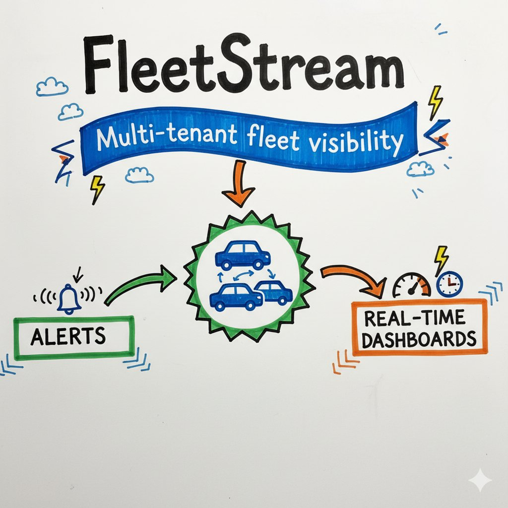

# FleetStream

Multi-tenant fleet visibility with alerts and real-time dashboards



## Product Overview

This repository implements a multi-tenant fleet operations platform. It ingests live telemetry from devices, streams real-time updates to operators, and provides tenant-scoped APIs and UI workflows for authentication, fleet management, alerts, and dashboard analytics.

## Product Feature Set

- Multi-tenant tenant onboarding and user authentication (register and login flows).
- Tenant profile and administration flows, including tenant status management.
- Device fleet management with CRUD operations for vehicle/device records.
- Device telemetry ingestion API with device key authentication (`X-Device-Key`).
- Tenant-scoped real-time telemetry streaming over WebSocket.
- Telemetry persistence with latest device position/last-seen updates.
- Alert rule management and automatic alert generation from telemetry conditions.
- Alert monitoring endpoints, unacknowledged counts, and acknowledgement workflows.
- Dashboard-oriented REST endpoints for fleet statistics and telemetry history.
- Tenant audit log retrieval for operational visibility.

## Platform and Engineering Capabilities

- Shared PostgreSQL schema with migration-first lifecycle and optional demo seeding.
- End-to-end API and frontend test coverage using isolated, reproducible E2E stacks.
- Local simulator support for generating telemetry traffic during development.

## Technical Overview

This project is organized as an Nx-based polyglot monorepo with a React frontend, Go ingestion/streaming service, Java business-domain API, shared PostgreSQL schema, and Docker/Helm deployment paths.

`apps/api-java` requires JDK 21.

## Technology Stack

| App | Technology |
|-----|-----------|
| `apps/frontend` | React 19, Vite, TypeScript |
| `apps/api-go` | Go 1.23, net/http |
| `apps/api-java` | Spring Boot 3.4, Java 21, Maven |
| `libs/ui-shared` | Shared React components |

## Quick Start

```bash
# Validate prerequisites + install dependencies
npm run setup

# Copy env file
cp .env.example .env

# Start full local stack (db + APIs + frontend)
npm run dev:up

# Start local stack with Prometheus + Grafana
npm run dev:up:obs

# Run backend and frontend E2E suites
npm run test:e2e:backend
npm run test:e2e:frontend
```

For full local workflows (Docker, tmux, local processes, troubleshooting), see `LOCAL_DEV.md`.

## Common Commands

```bash
# Build, lint, test all projects
npm run build
npm run lint
npm run test

# Migration-first database commands
npm run db:migrate
npm run db:seed

# Change-based CI-style execution
./node_modules/.bin/nx affected -t lint test build --base=origin/main
```

## Documentation Map

- Local development: `LOCAL_DEV.md`
- Local observability dashboard (Prometheus + Grafana): `LOCAL_DEV.md` (Option A)
- Contribution workflow: `.github/pull_request_template.md` and `lefthook.yml`
- Operational runbook (deploy/rollback/debug): `docs/runbook.md`
- System architecture: `docs/polyglot-architecture.md`
- Feature routing guide (Go vs Java): `docs/polyglot-architecture.md#feature-routing-guide-go-vs-java`
- Backend E2E architecture: `docs/e2e-architecture.md`
- Database migration conventions: `docs/db-migrations.md`
- ADRs: `docs/adr/`
- OpenAPI specs:
  - `docs/openapi/api-go.yaml`
  - `docs/openapi/api-java.yaml`

## Repository Layout

- `apps/` deployable services and test applications
- `libs/` shared libraries
- `charts/` per-service Helm charts
- `docs/` architecture, operations, and API documentation
- `tools/` simulator and developer automation scripts
