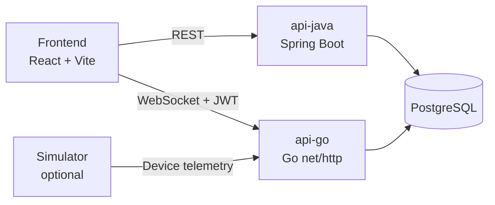

# Polyglot Project Architecture

## Purpose

This document describes the architecture of the Nx polyglot monorepo and how the main runtime, build, and deployment pieces fit together.

It complements:

- `docs/adr/0001-polyglot-monorepo.md` (decision record)
- `docs/e2e-architecture.md` (backend API E2E test architecture)

## Architecture Goals

- Keep service ownership clear across multiple languages.
- Provide one developer workflow (`nx`, npm scripts) across all projects.
- Support local development, CI, and Kubernetes deployment from one repo.
- Maintain tenant isolation and secure API boundaries.

## System Overview

### Runtime Components

- **Frontend** (`apps/frontend`): React + Vite application for operators.
- **Go API** (`apps/api-go`): telemetry ingestion and WebSocket streaming.
- **Java API** (`apps/api-java`): tenant, auth, fleet management, and dashboard-oriented REST APIs.
- **PostgreSQL** (`db`): shared multi-tenant relational storage.
- **Simulator** (`tools/simulator`): optional telemetry event generator for demo/local scenarios.

### High-Level Topology

## Service Responsibilities

### Frontend (`apps/frontend`)

- Calls Java API for auth, devices, alerts, and dashboard data.
- Uses Go API for live telemetry/WebSocket flows.
- Is deployed as a static web app (containerized with Nginx in Docker/K8s manifests).

### Go API (`apps/api-go`)

- Accepts telemetry via device API key-protected endpoint.
- Persists telemetry and updates device last-seen/position state.
- Broadcasts tenant-scoped real-time events over WebSocket.
- Exposes health and metrics endpoints for operations.

### Java API (`apps/api-java`)

- Handles tenant registration and user login flows.
- Provides tenant-scoped CRUD and dashboard-oriented endpoints.
- Reads telemetry history for dashboard APIs.
- Enforces tenant context for business-domain access.

### Database (`db`)

- Shared PostgreSQL schema with `tenant_id` as the primary isolation key.
- Domain tables include tenants, users, devices, alerts, and audit logs.
- Telemetry events are partitioned by time for scale and retention operations.

## Feature Routing Guide (Go vs Java)

Use this as the default decision guide for new backend features.

| Feature type                                                     | Primary service | Rationale                                                                  |
| ---------------------------------------------------------------- | --------------- | -------------------------------------------------------------------------- |
| Device-originated telemetry ingestion (`/api/devices/telemetry`) | Go API          | Optimized for high-frequency ingest, rate limiting, and real-time fan-out. |
| Real-time tenant streams (WebSocket)                             | Go API          | Owns WebSocket hub and low-latency event broadcast path.                   |
| User auth and tenant onboarding                                  | Java API        | Owns user-facing JWT login/register and tenant domain flows.               |
| Fleet/device CRUD, alerts, dashboard REST                        | Java API        | Owns business-domain REST and tenant-scoped query/read models.             |
| Operational health/metrics                                       | Service-local   | Keep existing probes stable: Go `/health`, Java `/actuator/health`.        |

For cross-service features (for example, new telemetry fields shown in dashboard views):

1. Implement ingestion/realtime changes in Go API.
2. Implement user-facing read/query/CRUD exposure in Java API.
3. Update shared DB migrations and add/adjust cross-service E2E coverage.

## Data and Security Model

### Tenant Isolation

- APIs resolve tenant identity from JWT claims or device credentials.
- Queries are tenant-scoped by design to prevent cross-tenant leakage.

### Authentication and Authorization

- User-facing APIs use JWT authentication.
- Java API enforces role-based authorization for sensitive write paths (for example device and alert-rule mutation endpoints) and platform-admin checks for `/api/admin/*` operations.
- Device telemetry ingestion uses `X-Device-Key` authentication.
- Go JWT middleware for realtime paths validates required claims (`sub`, `tenant_id`, `role`) and rejects unsupported roles.
- Frontend-origin CORS boundaries are enforced through environment configuration.

### Secrets and Configuration

- Local defaults come from `.env` / `.env.example`.
- Deployments should provide environment-specific secrets (e.g., JWT keys, DB credentials).

## Monorepo Architecture

### Repository Layout

- `apps/`: deployable services and test apps.
- `libs/`: shared libraries (`ui-shared`).
- `charts/`: per-service Helm charts.
- `docs/`: runbooks, ADRs, architecture docs, OpenAPI specs.
- `tools/`: simulator and developer automation scripts.

### Orchestration Layer (Nx)

- Nx is the cross-language task orchestrator.
- Common targets (`build`, `test`, `lint`) are standardized in workspace configs.
- Caching and dependency-aware execution reduce CI and local iteration time.
- Affected-only execution is used in CI for efficient change-based validation.

## Local Runtime Architecture

Primary local stack uses Docker Compose (`docker-compose.yml`):

- `db` on `5432`
- `api-go` on `9101`
- `api-java` on `9102`
- `frontend` on `9100`
- optional `simulator` profile for demo telemetry

The same repository also supports local-process and tmux-based workflows for active development.

## Build, Test, and CI Architecture

### Build/Test Surface

- `npm run lint` → `nx run-many -t lint`
- `npm run test` → `nx run-many -t test`
- `npm run build` → `nx run-many -t build`

### CI Workflow

`.github/workflows/ci.yml` defines:

1. **main job**
   - dependency and vulnerability checks
   - affected lint/test/build
   - coverage gates and container build path
2. **api-e2e job**
   - backend API E2E execution
   - Playwright artifact upload
   - sticky PR comment with result and run link

## Deployment Architecture

- Each runtime service has its own Helm chart under `charts/`.
- Environment overlays (staging/production) are provided via values files.
- Deployment, service, ingress, autoscaling, and policy resources are chart-managed per service.

## Operational Considerations

### Health and Observability

- Go API health: `/health`
- Java API health: `/actuator/health`
- CI and runbooks rely on these probes for readiness and diagnosis.

### Failure Domains

- Java and Go services are independently deployable and restartable.
- Both depend on PostgreSQL availability for core data paths.
- Frontend availability depends on backend API reachability for functional UX.

## Architectural Trade-offs

### Strengths

- Language-appropriate service implementation with unified delivery workflow.
- Clear service boundaries and independent scaling/deployment units.
- Strong local/CI parity with containerized runtime paths.

### Costs

- Multiple language toolchains increase developer environment complexity.
- Shared database requires disciplined schema/versioning governance across services.
- Cross-service behavior requires integration/E2E coverage to catch contract drift.

## Related Documents

- `README.md`
- `LOCAL_DEV.md`
- `docs/adr/0001-polyglot-monorepo.md`
- `docs/db-migrations.md`
- `docs/e2e-architecture.md`
- `docs/runbook.md`
- `docs/openapi/api-go.yaml`
- `docs/openapi/api-java.yaml`
